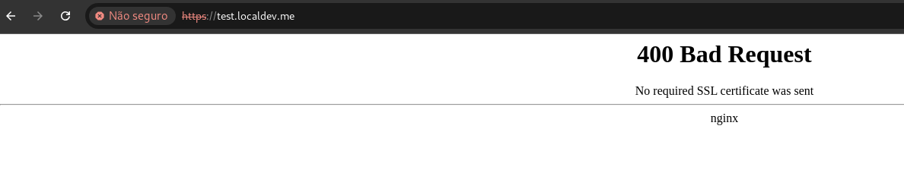

# Mutual TLS over kubernetes/nginx ingress controller

Requirements:
* [openssl](https://www.openssl.org/)
* [kind](https://kind.sigs.k8s.io/)
* [docker](https://www.docker.com/)
* [kubectl](https://kubernetes.io/pt-br/docs/reference/kubectl/)

## What is mutual TLS(mTLS) ?

Mutual TLS, or mTLS for short, is a method for mutual authentication. mTLS ensures that the parties at each end of a network connection are who they claim to be by verifying that they both have the correct private key. The information within their respective TLS certificates provides additional verification.

Mutual TLS concept lies under the umbrella of **Zero Trust Policy** where strict identity verification is required for any client/person/device trying to access any resources in a private network.

*Zero Trust means that no user, device, or network traffic is trusted by default, an approach that helps eliminate many security vulnerabilities.


## Create a kind cluster:
Apply the code below to create a kind cluster:
```
cat <<EOF | kind create cluster --config=-
kind: Cluster
apiVersion: kind.x-k8s.io/v1alpha4
nodes:
- role: control-plane
  kubeadmConfigPatches:
  - |
    kind: InitConfiguration
    nodeRegistration:
      kubeletExtraArgs:
        node-labels: "ingress-ready=true"
  extraPortMappings:
  - containerPort: 80
    hostPort: 80
    protocol: TCP
  - containerPort: 443
    hostPort: 443
    protocol: TCP
EOF
```

## Install nginx in cluster:

<pre>
kubectl --namespace ingress-nginx apply -f https://raw.githubusercontent.com/kubernetes/ingress-nginx/main/deploy/static/provider/kind/deploy.yaml
</pre>

## Deploy the app

Create a namespace to app:
<pre>
kubectl create ns app
</pre>


Deploy the app:
<pre>
kubectl apply -f k8s/app/app-deploy.yaml
</pre>


## Add TLS in ingress
Generate self-signed server certificate for domain **test.localdev.me**:
<pre>
openssl req -x509 -nodes -days 365 -newkey rsa:2048 -keyout server.key -out server.crt -subj '/CN=test.localdev.me/O=test.localdev.me'
</pre>

Let's create a tls secret file using the keys:
<pre>
kubectl -n app create secret tls localdev-tls --key server.key --cert server.crt
</pre>

Apply the ingress file:
<pre>
kubectl apply -f k8s/ingress/app-in-no-mtls.yaml
</pre>

It's working 🤩


# Add mTLS in ingress

First, let's create the “Certificate Authority” CA certificate to be used as our verification gate for client requests:
<pre>
openssl req -x509 -sha256 -newkey rsa:4096 -keyout ca.key -out ca.crt -days 356 -nodes -subj '/CN=My Cert Authority'
</pre>

Then apply the CA as secret to the kubernetes cluster:
<pre>
kubectl -n app create secret generic ca-secret --from-file=ca.crt=ca.crt
</pre>

Next we need to generate a client **Cert Signing Request** and client key:
<pre>
openssl req -new -newkey rsa:4096 -keyout client.key -out client.csr -nodes -subj '/CN=My Client'
</pre>

Now we need to sign this CSR “Certificate Signing Request” with the CA to generate the client certificate **which can be used to call the endpoint**:
<pre>
openssl x509 -req -sha256 -days 365 -in client.csr -CA ca.crt -CAkey ca.key -set_serial 02 -out client.crt
</pre>

Finally apply the [ingress](./k8s/ingress/app-in-with-mtls.yaml) file with a client verification annotations, one of them is to refer to the CA secret "app/ca-secret" that was created before, which is our verification authority:

Use the command below to apply the ingress file in cluster:
<pre>
kubectl apply -f k8s/ingress/app-in-with-mtls.yaml
</pre>

and we can see that it is working 🤩:




Let's test the call using the certificate:

<pre>
curl -k https://test.localdev.me/ --key client.key --cert client.crt
</pre>

It is working 🤩:


and we can see that the HTTP status code is equal to 200:


